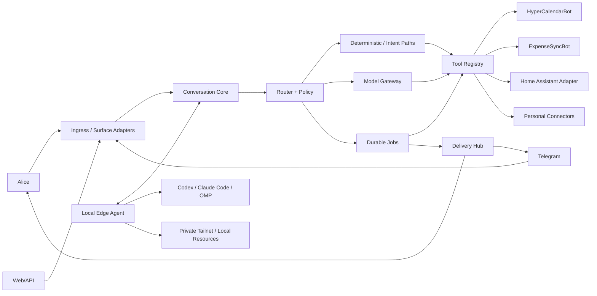

# AISIS Master Spec

**Status:** design specification  
**Language of implementation:** English identifiers; Russian-first UX  
**Authority:** this document defines product boundaries. Subsystem specs refine it but must not contradict it.

## 1. Product intent

AISIS is a continuously available personal AI assistant with permissioned access to personal digital resources. It should feel like one assistant even when the user talks through Alice, Telegram, a web UI, or a local computer agent.

The assistant handles four immediate domains: calendar, finance, home, and general questions. It also gains optional read/write access to Telegram, email, Notion, and Slack.

The system must support both fast conversational turns and long autonomous work. Long work may run for minutes or hours, expose progress, survive restarts, and deliver the result later.

## 2. Existing systems are capabilities, not code to copy

HyperCalendarBot remains the calendar source of truth and gains a surface-neutral adapter so Alice can use the same intent/tool engine as Telegram.

ExpenseSyncBot remains the finance source of truth. Its calculator semantics and regression corpus are reused by AISIS; currency and finance-specific behavior stays in ExpenseSyncBot.

`dext0r/yandex_smart_home` remains responsible for native Alice Smart Home commands such as “включи свет”. AISIS does not replace or duplicate that path.

AISIS adds the inverse conversational path: Alice/Telegram → AISIS → Home Assistant for compound, contextual, analytical, and AI-assisted requests.

## 3. High-level architecture



## 4. Core components

**Ingress / Surface Adapters** normalize Alice, Telegram, web, and edge events into one `Turn` contract and map one `Answer` contract back to the surface.

**Conversation Core** owns conversation identity, context references, pending questions, active jobs, result recall, and cross-surface continuity.

**Router + Policy** decides deterministic vs model vs long-job execution, chooses model tier and effort, and enforces read/write confirmation policy.

**Tool Registry** exposes domain and personal-resource capabilities through typed tool contracts. Tools never depend on a particular chat surface.

**Model Gateway** implements BYOK providers and local executors behind one protocol.

**Job Orchestrator** runs long work durably, checkpoints progress, supports waiting for the user, and stores final artifacts/results.

**Delivery Hub** sends final/progress output to permitted surfaces and remembers delivery state.

**Identity & Resource Graph** links one person to Alice, Telegram, Google, Slack, Notion, email, edge devices, calendars, and delegated resources.

## 5. Surfaces

The initial surfaces are:
- Alice Dialogs skill for the universal assistant and domain entry points.
- Telegram aggregator bot plus existing domain bots.
- Web configuration and authorization UI.
- Local Edge Agent for private/local executors and resources.
- Local voice speaker: self-hosted wake word, VAD and STT on the home box as an alternative to Alice (spec 140).

A surface is presentation and transport only. Business rules, tools, jobs, model routing, and memory live outside it.

## 6. Conversation UX

Fast requests should normally answer within one turn. The router prefers deterministic intents and direct tools for calendar lookup, calculator, known home queries, and other predictable operations.

If work will exceed the surface budget, AISIS immediately acknowledges it and creates a `Job`. The user can ask “статус?”, “что с моим прошлым запросом?” or refer to it naturally.

When a completed job is encountered on a later Alice turn, the assistant should restore context: “Ты спрашивал … Ответ готов. Рассказать сейчас или позже?”

Telegram can deliver completion automatically. Alice Dialogs cannot initiate a normal skill conversation, so proactive Station speech is a separate optional delivery adapter, not an assumption of the core.

## 7. Alice constraints

A Yandex Dialogs webhook must return the complete response within the platform deadline; AISIS does not attempt to stream an unfinished webhook response.

Alice has separate display and speech fields. AISIS therefore treats `display_text` and `speech_text` as distinct outputs everywhere, even on surfaces that currently use only one.

Alice account identity is not equivalent to secure speaker biometric identity. Voice recognition may be a UX hint if the platform ever exposes a useful signal, but it is not an authorization boundary.

## 8. Telegram UX

The aggregator bot supports ordinary messages, voice input, status queries, durable jobs, and rich final answers.

For long answers the preferred transport is Telegram Rich Messages: short summary first, expandable/details content below, finalized as one rich message. Streaming draft APIs may be used for live progress when supported.

A compatibility fallback must preserve one logical answer: concise Telegram message plus a canonical result page/artifact rather than arbitrary 4096-character chunk spam.

## 9. Model strategy

Models are configured by aliases, not hard-coded into product logic:
- `fast` — low latency, low cost.
- `balanced` — default complex conversational work.
- `deep` — difficult reasoning, optionally GPT-6 Astra or another configured frontier model.
- `background` — long jobs optimized for throughput/cost.

The initial fast default may use DeepSeek V4.1 Flash when the user has configured that provider.

Route selection is pluggable. The policy chain is deterministic rules → optional local Laya → optional Jev decision model → conservative fallback.

The route decision may select both model alias and reasoning effort. Provider failures trigger explicit configured fallbacks, never silent uncontrolled provider switching.

## 10. BYOK and local executors

Users can connect their own Hugging Face, OpenRouter, OpenAI, DeepSeek, and later other provider credentials through web setup or a chat-generated secure link.

A Local Edge Agent can expose installed Codex, Claude Code, and OMP sessions as long-running executors. The edge agent uses outbound authenticated connectivity and never requires an inbound public port.

The edge layer is a standalone signed binary for macOS and Windows; it must not assume Python is preinstalled.

## 11. Home Assistant

The user's current Home Assistant endpoint is private inside Tailscale. AISIS reaches it through a local edge connection or a colocated trusted worker; Home Assistant itself does not need to become a public Alice webhook.

The HA domain supports state queries, entity/area discovery, history, service calls, scenes/scripts, and compound plans. Writes are classified by risk and may require confirmation.

The existing native Yandex Smart Home integration remains the shortest path for direct device commands.

## 12. Personal connectors

V1 optional connectors are Telegram personal account (MTProto), email, Notion, and Slack.

Each connector declares granular read/search/write capabilities and required scopes. A user can connect read-only access without enabling writes.

Telegram MTProto supports recent-dialog lookup, recent-message search, recipient resolution, and sending. Recipient identity uses stable numeric peer identity; username is only a hint.

## 13. Memory and recipient resolution

AISIS stores explicit user-approved aliases and interaction-derived non-sensitive routing signals such as recency/frequency of communication.

Telegram recipient search combines exact IDs/usernames, normalized names, aliases, transliteration, fuzzy similarity, recent dialogs, reply frequency, mutual chats, and prior confirmed resolutions.

A low-confidence or high-impact write must ask for confirmation instead of guessing the recipient.

## 14. Calculator and rendering

AISIS reuses the tested ExpenseSyncBot calculator semantics: safe parsing, exact decimal arithmetic where required, operator precedence, percentages, and currency-aware expressions.

The generic calculator adds richer grammar and a canonical numeric representation. Rendering is a separate layer.

A result can therefore be:
```json
{"value":"0.333333333333333333","display_text":"1/3","speech_text":"одна треть","approximate":false}
```

Simple fractions are recovered only when mathematically justified within a strict tolerance and bounded denominator. Money is normally rendered as decimal currency, not fractions.

## 15. Long-running jobs

Every long operation becomes a durable `Job` with:
- original user request and conversation reference;
- selected executor/model route;
- status and structured progress;
- resumable checkpoints;
- optional pending-user question;
- final structured answer/artifacts;
- delivery targets and delivery receipts.

Statuses are `queued | running | waiting_user | succeeded | failed | cancelled`.

A job is idempotent where possible and has explicit cancellation and retry semantics.

## 16. Security model

Secrets are encrypted at rest and referenced by secret IDs; tool calls and prompts never receive raw provider credentials.

Local MTProto sessions and local-computer harness credentials should remain on the edge device by default.

Resource permissions are capability-based and least-privilege. Read and write grants are separate.

Destructive, financial, external-communication, and privacy-sensitive actions are logged and governed by configurable confirmation policy.

Cross-person calendar or messaging access is allowed only by explicit ACL/delegation, never inferred from household proximity or voice.

## 17. Observability and debugging

Every turn receives a trace ID. The system records routing decisions, selected model alias/effort, tool calls, latency, token/cost metadata, job state transitions, and delivery receipts without logging secrets.

A debug console can reconstruct “why did the assistant do this?” across surfaces and domain services.

Users must be able to inspect active jobs and recent actions in Telegram and web UI.

## 18. Reliability targets

Alice ingress reserves enough budget to render a valid response before the platform deadline; slow work is converted to a job before that budget is exhausted.

Fast deterministic paths should not invoke an LLM. Tool and provider timeouts are bounded and observable.

The system must tolerate worker restart without losing jobs, pending results, resource links, or delivery state.

## 19. Scope ordering encoded by architecture

The first usable vertical slice is identity + surfaces + durable jobs + calendar + calculator + provider routing.

Home Assistant, finance orchestration, and personal connectors plug into the same contracts rather than creating parallel frameworks.

Commerce/price lookup from the original product vision remains an intended domain, but is not allowed to distort V1 core contracts; it plugs in later as another tool provider.

## 20. Acceptance criteria for this design

A single user identity can be linked to Alice and Telegram and invoke the same conversation/tool core.

“Что у меня сегодня?”, “посчитай…”, a compound HA request, and a general question route through the same interaction contract but to different tools/models.

A long request creates a job, is queryable by status, finishes independently, auto-delivers to Telegram if enabled, and is recoverable on the next Alice turn.

Existing HyperCalendarBot and ExpenseSyncBot remain operational independently while exposing reusable capability adapters.

No core component depends on Telegram IDs, Alice request JSON, a specific model vendor, or direct public access to Home Assistant.
